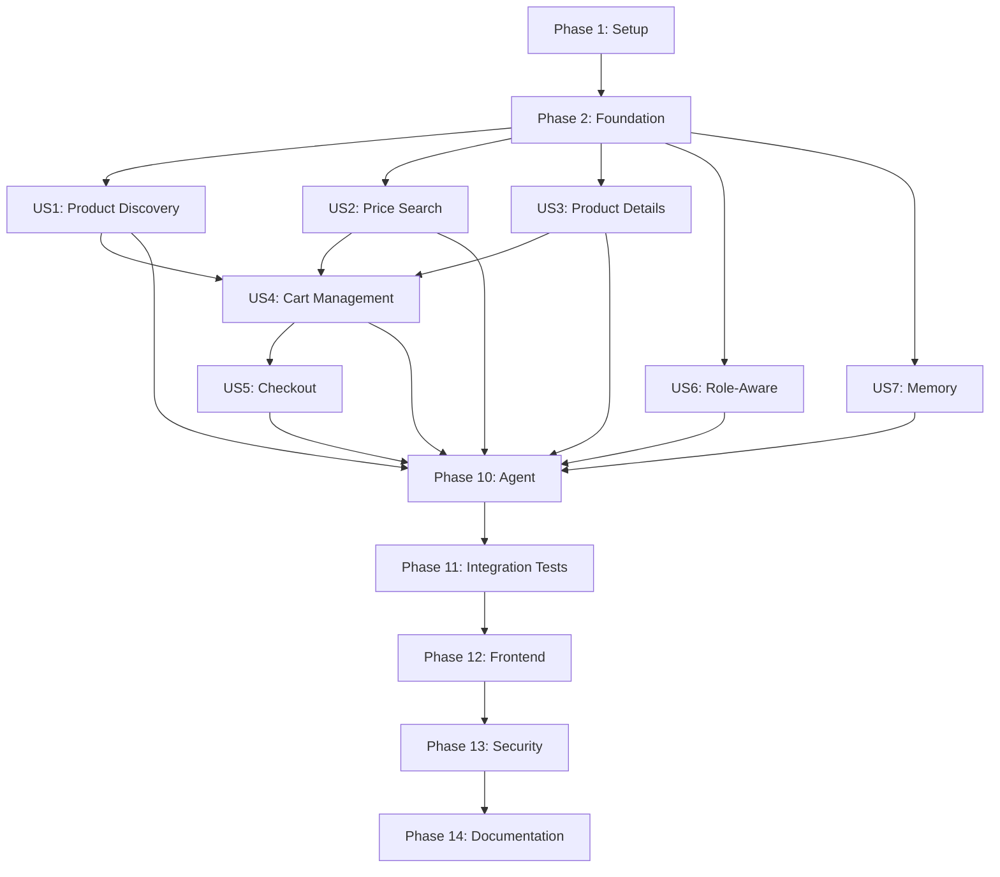

# Tasks: AI-Powered Conversational Shopping Assistant

**Feature**: Symfony AI-based conversational shopping assistant with tool-calling agents  
**Input Documents**: plan.md, spec.md  
**Architecture**: DDD-compliant (Domain → Application → Infrastructure)  
**Testing**: Comprehensive unit, integration, and E2E tests for all components

---

## Format: `- [ ] T### [P?] [Story?] Description with file path`

- **[P]**: Can run in parallel (different files, no dependencies)
- **[US#]**: User story number (1-7, maps to spec.md priorities)
- File paths are absolute from project root

---

## Phase 1: Setup (Package Installation & Configuration)

**Purpose**: Install Symfony AI packages and configure AI platforms

- [X] T101 Install symfony/ai-agent package via composer require symfony/ai-agent in composer.json
- [X] T102 Install symfony/ai-bundle package via composer require symfony/ai-bundle in composer.json
- [X] T103 Install symfony/ai-chat package via composer require symfony/ai-chat in composer.json
- [X] T104 Install symfony/ai-platform package via composer require symfony/ai-platform in composer.json
- [X] T105 Install symfony/ai-store package via composer require symfony/ai-store in composer.json
- [ ] T106 Run composer update to install all AI packages and dependencies
- [X] T107 Create AI configuration file with OpenAI and Ollama platforms in config/packages/ai.yaml
- [X] T108 Add OPENAI_API_KEY environment variable to .env and .env.example
- [X] T109 Add OLLAMA_HOST_URL environment variable (Docker HTTP endpoint) to .env and .env.example
- [X] T110 Configure primary agent "local_ollama" with tool-calling, memory, and token tracking in config/packages/ai.yaml
- [X] T111 Create system prompt configuration for shopping assistant agent in config/packages/ai.yaml

**Checkpoint**: Symfony AI packages installed and configured with OpenAI & Ollama platforms

---

## Phase 2: Foundational (Core AI Infrastructure)

**Purpose**: AI Tools directory structure, base services, and shared infrastructure

**⚠️ CRITICAL**: Must complete before implementing any user stories

- [X] T112 Create AI Tools directory structure at src/Infrastructure/AI/Tool/
- [X] T113 Create AI Agent directory structure at src/Infrastructure/AI/Agent/
- [X] T114 Create AI Service directory structure at src/Infrastructure/AI/Service/
- [X] T115 Create Application Use Cases directory for AI at src/Application/UseCase/AI/
- [X] T116 [P] Create ConversationManager service for session-based conversation history in src/Infrastructure/AI/Service/ConversationManager.php
- [X] T117 [P] Create RoleAwareAssistant service for role-based response filtering in src/Infrastructure/AI/Service/RoleAwareAssistant.php
- [X] T118 [P] Create AIAssistantController with POST /api/ai/chat endpoint in src/Infrastructure/Controller/AIAssistantController.php
- [X] T119 Configure AI routes for /api/ai/* in config/routes.yaml
- [X] T120 Register AI services with dependency injection in config/services.yaml

**Checkpoint**: Core AI infrastructure ready - user story implementation can begin in parallel

---

## Phase 3: User Story 1 - Product Discovery via AI (Priority: P1) 🎯 MVP

**Goal**: Enable natural language product search by name or category

**Independent Test**: User asks "Show me all products" and receives complete catalog list

### Unit Tests for User Story 1

- [X] T121 [P] [US1] Create unit test for GetProductsName use case in tests/Application/UseCase/AI/GetProductsNameTest.php
- [X] T122 [P] [US1] Create integration test for GetProductsNameTool with mock agent in tests/Infrastructure/AI/Tool/GetProductsNameToolTest.php

### Implementation for User Story 1

- [X] T123 [P] [US1] Create GetProductsName use case in src/Application/UseCase/AI/GetProductsName.php
- [X] T124 [US1] Create GetProductsNameTool with #[AsTool] annotation in src/Infrastructure/AI/Tool/GetProductsNameTool.php
- [X] T125 [US1] Implement tool parameter schema (optional: category filter, search term) in GetProductsNameTool
- [X] T126 [US1] Register GetProductsNameTool as tagged service in config/services.yaml
- [X] T127 [US1] Add GetProductsNameTool to agent tool registry in config/packages/ai.yaml

**Checkpoint**: User Story 1 complete - users can discover products via natural language

---

## Phase 4: User Story 2 - Price-Based Product Search (Priority: P1) 🎯 MVP

**Goal**: Enable budget-based product filtering through conversational queries

**Independent Test**: User asks "Show me products under $50" and receives only matching items

### Unit Tests for User Story 2

- [X] T128 [P] [US2] Create unit test for GetProductsNameByMaxPrice use case in tests/Application/UseCase/AI/GetProductsNameByMaxPriceTest.php
- [X] T129 [P] [US2] Create integration test for GetProductsNameByMaxPriceTool in tests/Infrastructure/AI/Tool/GetProductsNameByMaxPriceToolTest.php

### Implementation for User Story 2

- [X] T130 [P] [US2] Create GetProductsNameByMaxPrice use case with price filtering logic in src/Application/UseCase/AI/GetProductsNameByMaxPrice.php
- [X] T131 [US2] Create GetProductsNameByMaxPriceTool with #[AsTool] annotation in src/Infrastructure/AI/Tool/GetProductsNameByMaxPriceTool.php
- [X] T132 [US2] Implement tool parameter schema (maxPrice: float, currency: string, optional: category) in GetProductsNameByMaxPriceTool
- [X] T133 [US2] Register GetProductsNameByMaxPriceTool as tagged service in config/services.yaml
- [X] T134 [US2] Add GetProductsNameByMaxPriceTool to agent tool registry in config/packages/ai.yaml

**Checkpoint**: User Stories 1 & 2 complete - full product discovery with price filtering

---

## Phase 5: User Story 3 - Product Details Lookup (Priority: P1) 🎯 MVP

**Goal**: Provide detailed product information (price, images, stock) on request

**Independent Test**: User asks "How much does product X cost?" and receives accurate price + stock status

### Unit Tests for User Story 3

- [X] T135 [P] [US3] Create unit test for GetPriceByProductId use case in tests/Application/UseCase/AI/GetPriceByProductIdTest.php
- [X] T136 [P] [US3] Create unit test for GetProductImagesByProductId use case in tests/Application/UseCase/AI/GetProductImagesByProductIdTest.php
- [X] T137 [P] [US3] Create integration test for GetPriceByProductIdTool in tests/Infrastructure/AI/Tool/GetPriceByProductIdToolTest.php
- [X] T138 [P] [US3] Create integration test for GetProductImagesByProductIdTool in tests/Infrastructure/AI/Tool/GetProductImagesByProductIdToolTest.php

### Implementation for User Story 3

- [X] T139 [P] [US3] Create GetPriceByProductId use case in src/Application/UseCase/AI/GetPriceByProductId.php
- [X] T140 [P] [US3] Create GetProductImagesByProductId use case in src/Application/UseCase/AI/GetProductImagesByProductId.php
- [X] T141 [US3] Create GetPriceByProductIdTool with #[AsTool] annotation in src/Infrastructure/AI/Tool/GetPriceByProductIdTool.php
- [X] T142 [US3] Implement tool parameter schema (productId: string) in GetPriceByProductIdTool
- [X] T143 [US3] Create GetProductImagesByProductIdTool with #[AsTool] annotation in src/Infrastructure/AI/Tool/GetProductImagesByProductIdTool.php
- [X] T144 [US3] Implement tool parameter schema (productId: string) in GetProductImagesByProductIdTool
- [X] T145 [US3] Register both tools as tagged services in config/services.yaml
- [X] T146 [US3] Add both tools to agent tool registry in config/packages/ai.yaml

**Checkpoint**: MVP COMPLETE - Users can discover, filter, and inspect products via AI

---

## Phase 6: User Story 4 - Cart Management via AI (Priority: P2)

**Goal**: Enable adding products to cart and viewing cart status through conversation

**Independent Test**: User says "Add 2 units to cart" then "What's my total?" and receives accurate calculation

### Unit Tests for User Story 4

- [ ] T147 [P] [US4] Create unit test for AddToCartForUser use case in tests/Application/UseCase/AI/AddToCartForUserTest.php
- [ ] T148 [P] [US4] Create unit test for GetCartTotalForUser use case in tests/Application/UseCase/AI/GetCartTotalForUserTest.php
- [ ] T149 [P] [US4] Create integration test for AddToCartTool in tests/Infrastructure/AI/Tool/AddToCartToolTest.php
- [ ] T150 [P] [US4] Create integration test for GetCartTotalTool in tests/Infrastructure/AI/Tool/GetCartTotalToolTest.php

### Implementation for User Story 4

- [ ] T151 [P] [US4] Create AddToCartForUser use case (delegates to existing AddProductToCart) in src/Application/UseCase/AI/AddToCartForUser.php
- [ ] T152 [P] [US4] Create GetCartTotalForUser use case in src/Application/UseCase/AI/GetCartTotalForUser.php
- [ ] T153 [US4] Create AddToCartTool with #[AsTool] annotation in src/Infrastructure/AI/Tool/AddToCartTool.php
- [ ] T154 [US4] Implement tool parameter schema (productId: string, quantity: int) with user context in AddToCartTool
- [ ] T155 [US4] Create GetCartTotalTool with #[AsTool] annotation in src/Infrastructure/AI/Tool/GetCartTotalTool.php
- [ ] T156 [US4] Implement tool with user context from Symfony Security in GetCartTotalTool
- [ ] T157 [US4] Add authentication requirement to cart tools in config/packages/security.yaml
- [ ] T158 [US4] Register both cart tools as tagged services in config/services.yaml
- [ ] T159 [US4] Add both cart tools to agent tool registry in config/packages/ai.yaml

**Checkpoint**: User Stories 1-4 complete - Full product discovery + cart management

---

## Phase 7: User Story 5 - Guided Checkout Process (Priority: P2)

**Goal**: Enable completing orders through conversational checkout with explicit confirmation

**Independent Test**: User says "Checkout to [address]", confirms, and receives order number

### Unit Tests for User Story 5

- [ ] T160 [P] [US5] Create unit test for CheckoutOrderForUser use case in tests/Application/UseCase/AI/CheckoutOrderForUserTest.php
- [ ] T161 [P] [US5] Create integration test for CheckoutOrderTool in tests/Infrastructure/AI/Tool/CheckoutOrderToolTest.php
- [ ] T162 [P] [US5] Create E2E test for complete checkout conversation flow in tests/E2E/AICheckoutConversationTest.php

### Implementation for User Story 5

- [ ] T163 [US5] Create CheckoutOrderForUser use case (delegates to existing Checkout) in src/Application/UseCase/AI/CheckoutOrderForUser.php
- [ ] T164 [US5] Create CheckoutOrderTool with #[AsTool] annotation in src/Infrastructure/AI/Tool/CheckoutOrderTool.php
- [ ] T165 [US5] Implement tool parameter schema (shippingAddress: string, confirmation: bool) in CheckoutOrderTool
- [ ] T166 [US5] Add explicit confirmation validation before executing checkout in CheckoutOrderTool
- [ ] T167 [US5] Add transaction rollback on checkout failure in CheckoutOrderForUser use case
- [ ] T168 [US5] Register CheckoutOrderTool as tagged service in config/services.yaml
- [ ] T169 [US5] Add CheckoutOrderTool to agent tool registry in config/packages/ai.yaml
- [ ] T170 [US5] Update system prompt to require explicit confirmation for checkout in config/packages/ai.yaml

**Checkpoint**: User Stories 1-5 complete - Full shopping flow from discovery to checkout

---

## Phase 8: User Story 6 - Role-Aware Responses (Priority: P3)

**Goal**: Tailor AI responses based on user role (customer/seller/admin)

**Independent Test**: Admin asks for stats and receives data; customer asks same and is denied

### Unit Tests for User Story 6

- [ ] T171 [P] [US6] Create unit test for RoleAwareAssistant service in tests/Infrastructure/AI/Service/RoleAwareAssistantTest.php
- [ ] T172 [P] [US6] Create integration test for role-based tool access control in tests/Infrastructure/AI/RoleBasedAccessTest.php

### Implementation for User Story 6

- [ ] T173 [US6] Update RoleAwareAssistant to inject Symfony Security component in src/Infrastructure/AI/Service/RoleAwareAssistant.php
- [ ] T174 [US6] Implement role detection from authenticated user context in RoleAwareAssistant
- [ ] T175 [US6] Add role validation to each tool's execute method (check ROLE_CUSTOMER, ROLE_SELLER, ROLE_ADMIN)
- [ ] T176 [US6] Update system prompt to include role-aware behavior instructions in config/packages/ai.yaml
- [ ] T177 [US6] Create GetUserRoleTool for agent to query current user role in src/Infrastructure/AI/Tool/GetUserRoleTool.php
- [ ] T178 [US6] Register GetUserRoleTool and update agent configuration in config/packages/ai.yaml

**Checkpoint**: User Stories 1-6 complete - Role-aware conversational commerce

---

## Phase 9: User Story 7 - Conversation Memory & Context (Priority: P3)

**Goal**: Enable multi-turn conversations with context retention

**Independent Test**: User refers to "it" or "that product" from previous message and AI understands

### Unit Tests for User Story 7

- [ ] T179 [P] [US7] Create unit test for ConversationManager service in tests/Infrastructure/AI/Service/ConversationManagerTest.php
- [ ] T180 [P] [US7] Create integration test for multi-turn conversation persistence in tests/Infrastructure/AI/ConversationMemoryTest.php

### Implementation for User Story 7

- [ ] T181 [US7] Implement conversation history storage using Symfony session in ConversationManager
- [ ] T182 [US7] Add addMessage, getHistory, clearHistory methods to ConversationManager
- [ ] T183 [US7] Configure ai-store package for conversation persistence in config/packages/ai.yaml
- [ ] T184 [US7] Update ShoppingAssistantAgent to use ConversationManager for history in src/Infrastructure/AI/Agent/ShoppingAssistantAgent.php
- [ ] T185 [US7] Add conversation context to each agent invocation in AIAssistantController
- [ ] T186 [US7] Implement conversation cleanup on logout event in ConversationManager
- [ ] T187 [US7] Add conversation ID tracking for debugging in ConversationManager

**Checkpoint**: All user stories complete - Full conversational AI shopping assistant

---

## Phase 10: Agent Implementation & Orchestration

**Purpose**: Create main agent and integrate all tools

- [ ] T188 Create ShoppingAssistantAgent class with tool registry in src/Infrastructure/AI/Agent/ShoppingAssistantAgent.php
- [ ] T189 Implement agent initialization with configured LLM platform in ShoppingAssistantAgent
- [ ] T190 Register all 9 tools (7 shopping + 1 role + 1 future) with agent in ShoppingAssistantAgent
- [ ] T191 Implement tool execution error handling and fallback responses in ShoppingAssistantAgent
- [ ] T192 Add token usage tracking and logging in ShoppingAssistantAgent
- [ ] T193 Implement streaming response support (optional) in ShoppingAssistantAgent
- [ ] T194 Create agent factory service for dependency injection in src/Infrastructure/AI/Service/AgentFactory.php

**Checkpoint**: Agent fully functional with all tools registered

---

## Phase 11: Integration Testing

**Purpose**: Validate complete AI shopping assistant workflows

### Conversational Scenario Tests

- [ ] T195 [P] Create E2E test: "Show products under $50" → response validation in tests/E2E/ProductSearchConversationTest.php
- [ ] T196 [P] Create E2E test: "Add product X to cart" → "Show cart" → total verification in tests/E2E/CartManagementConversationTest.php
- [ ] T197 [P] Create E2E test: Complete checkout flow with confirmation in tests/E2E/CheckoutConversationTest.php
- [ ] T198 [P] Create E2E test: Multi-turn conversation with context ("show laptops" → "tell me about the second one") in tests/E2E/ContextualConversationTest.php
- [ ] T199 [P] Create E2E test: Role-based access (admin stats vs customer denial) in tests/E2E/RoleBasedConversationTest.php

### Agent Configuration Tests

- [ ] T200 [P] Create test for agent tool registration and availability in tests/Infrastructure/AI/AgentConfigurationTest.php
- [ ] T201 [P] Create test for OpenAI platform configuration in tests/Infrastructure/AI/PlatformConfigurationTest.php
- [ ] T202 [P] Create test for Ollama platform configuration in tests/Infrastructure/AI/PlatformConfigurationTest.php
- [ ] T203 [P] Create test for conversation memory persistence in tests/Infrastructure/AI/MemoryPersistenceTest.php
- [ ] T204 [P] Create test for token usage tracking in tests/Infrastructure/AI/TokenTrackingTest.php

### Error Handling Tests

- [ ] T205 [P] Create test for tool execution failures and graceful degradation in tests/Infrastructure/AI/ErrorHandlingTest.php
- [ ] T206 [P] Create test for invalid product ID handling in tests/Infrastructure/AI/InvalidInputTest.php
- [ ] T207 [P] Create test for authentication failures in cart/checkout tools in tests/Infrastructure/AI/AuthenticationTest.php
- [ ] T208 [P] Create test for LLM API downtime fallback in tests/Infrastructure/AI/APIDowntimeTest.php

**Checkpoint**: All integration tests pass - system is production-ready

---

## Phase 12: Frontend Integration

**Purpose**: Connect existing chatbot UI to new AI assistant backend

- [ ] T209 Update chatbot.js to call /api/ai/chat endpoint instead of old endpoint in public/js/chatbot.js
- [ ] T210 Add loading indicators during AI thinking/tool execution in public/js/chatbot.js
- [ ] T211 Add tool usage badges (e.g., "Searching products...") in public/js/chatbot.js
- [ ] T212 Implement product image display inline in chat messages in public/js/chatbot.js
- [ ] T213 Add cart update notifications in chat widget in public/js/chatbot.js
- [ ] T214 Update chatbot widget template with AI assistant branding in templates/chatbot/widget.html.twig
- [ ] T215 Add streaming response support for real-time typing effect (optional) in public/js/chatbot.js
- [ ] T216 Add conversation clear button in chatbot UI in public/js/chatbot.js

**Checkpoint**: Frontend fully integrated with AI assistant backend

---

## Phase 13: Security & Performance Optimization

**Purpose**: Harden security and optimize for production load

### Security Hardening

- [ ] T217 [P] Add input sanitization for all tool parameters in each tool's execute method
- [ ] T218 [P] Implement rate limiting (60 req/min per user) on /api/ai/chat endpoint
- [ ] T219 [P] Add audit logging for all checkout operations in CheckoutOrderTool
- [ ] T220 [P] Implement CSRF protection for AI assistant endpoint in config/packages/security.yaml
- [ ] T221 [P] Add UUID validation for productId parameters in all product tools
- [ ] T222 [P] Mask sensitive data in conversation logs in ConversationManager

### Performance Optimization

- [ ] T223 [P] Add caching for product catalog queries (5 min TTL) in GetProductsName use case
- [ ] T224 [P] Implement async tool execution where possible in ShoppingAssistantAgent
- [ ] T225 [P] Add database query optimization indexes for AI queries in migrations
- [ ] T226 [P] Configure connection pooling for LLM API requests in config/packages/ai.yaml
- [ ] T227 [P] Implement conversation history size limit (last 20 messages) in ConversationManager

**Checkpoint**: System secured and optimized for production

---

## Phase 14: Documentation & Monitoring

**Purpose**: Create documentation and set up monitoring

- [ ] T228 [P] Create README for AI assistant feature in .specify/specs/002-ai-shopping-assistant/README.md
- [ ] T229 [P] Document how to add new AI tools (developer guide) in .specify/specs/002-ai-shopping-assistant/ADDING_TOOLS.md
- [ ] T230 [P] Create API documentation for /api/ai/chat endpoint in API.md
- [ ] T231 [P] Add inline code documentation for all use cases and tools
- [ ] T232 [P] Create monitoring dashboard queries for AI metrics (response time, tool usage, errors)
- [ ] T233 [P] Set up alerting for high error rates or API downtime
- [ ] T234 [P] Create runbook for common AI assistant issues

**Checkpoint**: Complete documentation and monitoring in place

---

## Dependencies Between User Stories

---

## Parallel Execution Opportunities

### Phase 3 (US1) - Product Discovery
- **Parallel**: T121, T122, T123 (tests and use case - different files)
- **Sequential**: T124 → T125 → T126 → T127 (tool creation depends on use case)

### Phase 4 (US2) - Price Search
- **Parallel**: T128, T129, T130 (tests and use case)
- **Sequential**: T131 → T132 → T133 → T134 (tool chain)

### Phase 5 (US3) - Product Details
- **Parallel**: T135, T136, T137, T138, T139, T140 (2 use cases + 4 tests - all different files)
- **Sequential**: T141 → T142, T143 → T144 (each tool's schema)
- **Parallel**: T145, T146 (registration tasks)

### Phase 6 (US4) - Cart Management
- **Parallel**: T147, T148, T149, T150, T151, T152 (2 use cases + 4 tests)
- **Sequential**: T153 → T154, T155 → T156 (tool implementations)
- **Parallel**: T157, T158, T159 (configuration tasks)

### Phase 11 - Integration Testing
- **Fully Parallel**: T195-T208 (all test files independent)

### Phase 13 - Security & Performance
- **Fully Parallel**: T217-T227 (independent optimization tasks)

### Phase 14 - Documentation
- **Fully Parallel**: T228-T234 (independent documentation files)

---

## Implementation Strategy

### MVP Scope (Phases 1-5)
Priority: Complete User Stories 1-3 for immediate value
- **Week 1**: Setup + Foundation (T101-T120)
- **Week 2**: US1 Product Discovery (T121-T127)
- **Week 3**: US2 Price Search + US3 Product Details (T128-T146)
- **Week 4**: Agent integration + basic testing

### Full Feature Scope (Phases 1-14)
- **Weeks 5-6**: US4 Cart + US5 Checkout (T147-T170)
- **Week 7**: US6 Role + US7 Memory (T171-T187)
- **Week 8**: Agent orchestration (T188-T194)
- **Weeks 9-10**: Integration testing (T195-T208)
- **Week 11**: Frontend + Security (T209-T227)
- **Week 12**: Documentation + Launch (T228-T234)

---

## Success Criteria

- ✅ All 134 tasks completed
- ✅ All 7 user stories independently testable
- ✅ Test coverage >80% for Application and Infrastructure/AI layers
- ✅ Zero business logic in Infrastructure/AI/Tool classes
- ✅ All tools properly annotated with #[AsTool]
- ✅ Agent handles 20+ conversational scenarios
- ✅ Response time <3s for tool-heavy conversations
- ✅ No security vulnerabilities in penetration testing
- ✅ Documentation complete for adding new tools

---

## Task Count Summary

- **Phase 1 (Setup)**: 11 tasks (T101-T111)
- **Phase 2 (Foundation)**: 9 tasks (T112-T120)
- **Phase 3 (US1)**: 7 tasks (T121-T127)
- **Phase 4 (US2)**: 7 tasks (T128-T134)
- **Phase 5 (US3)**: 12 tasks (T135-T146)
- **Phase 6 (US4)**: 13 tasks (T147-T159)
- **Phase 7 (US5)**: 11 tasks (T160-T170)
- **Phase 8 (US6)**: 6 tasks (T171-T178)
- **Phase 9 (US7)**: 7 tasks (T179-T187)
- **Phase 10 (Agent)**: 7 tasks (T188-T194)
- **Phase 11 (Integration)**: 14 tasks (T195-T208)
- **Phase 12 (Frontend)**: 8 tasks (T209-T216)
- **Phase 13 (Security)**: 11 tasks (T217-T227)
- **Phase 14 (Documentation)**: 7 tasks (T228-T234)

**TOTAL: 134 tasks**

---

## Notes

1. **Tests are REQUIRED**: Each use case and tool must have corresponding unit/integration tests
2. **DDD Compliance**: Business logic ONLY in Application layer, tools are pure adapters
3. **Parallel Execution**: Tasks marked [P] can be executed simultaneously
4. **MVP Focus**: Phases 1-5 (US1-US3) deliver immediate value
5. **Security First**: All tools validate authentication and authorization
6. **Documentation**: Each phase includes inline documentation requirements
