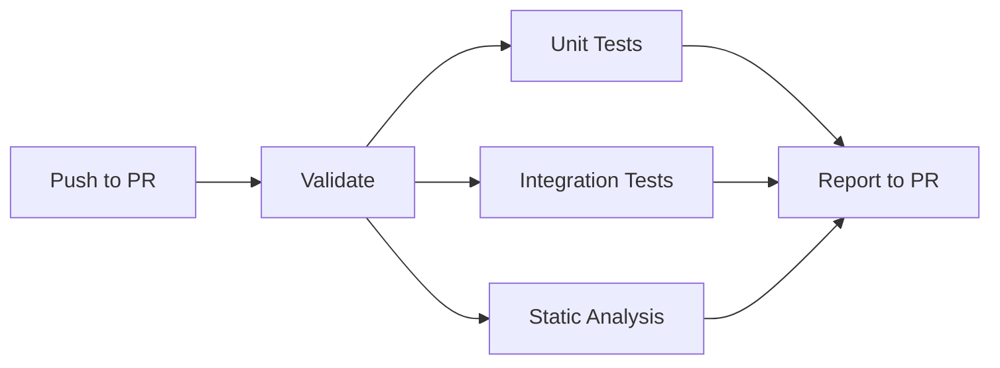
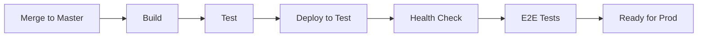
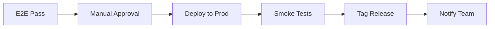
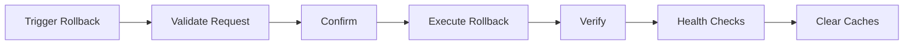

# CI/CD Pipeline Usage Guide

## Local Docker CI/CD Infrastructure

This guide explains how to use the fully local Docker-based CI/CD pipeline for development and testing.

## Architecture Overview

```
┌──────────────────────────────────────────────────────────────┐
│                     Local Development Machine                 │
│                                                                │
│  ┌────────────┐      ┌─────────────┐      ┌─────────────┐   │
│  │  Jenkins   │─────▶│ Test (8081) │      │ Prod (8082) │   │
│  │  (9090)    │      │  Container  │      │  Container  │   │
│  └────────────┘      └─────────────┘      └─────────────┘   │
│        │                    │                     │           │
│        │              ┌─────┴─────┐         ┌────┴─────┐    │
│        │              │  MySQL    │         │  MySQL   │    │
│        │              │  Redis    │         │  Redis   │    │
│        │              │  MongoDB  │         │  MongoDB │    │
│        │              │  RabbitMQ │         │  RabbitMQ│    │
│        │              └───────────┘         └──────────┘    │
│        │                                                      │
│        └──────────────────────────────────────────────────┐  │
│                          Docker Socket                      │  │
└──────────────────────────────────────────────────────────────┘
```

## Pipeline Workflows

### 1. Pull Request Validation

**Trigger**: Open/update PR
**Purpose**: Validate code quality before merge
**Duration**: ~8-12 minutes



**What runs**:
- Composer validation
- PHP syntax check
- Unit tests (parallel)
- Integration tests (parallel)
- PHPStan static analysis
- PHP-CS-Fixer style check

**View results**: PR status checks on GitHub

### 2. Test Environment Deployment

**Trigger**: Merge to master
**Purpose**: Automated deployment to localhost:8081
**Duration**: ~15-20 minutes



**What runs**:
1. Build assets and dependencies
2. Full test suite
3. Deploy to test container using Ansible
4. Health check verification
5. Playwright E2E tests

**Access**: http://localhost:8081

### 3. Production Deployment

**Trigger**: Manual approval after test deployment
**Purpose**: Deploy to localhost:8082
**Duration**: ~10-15 minutes (excluding approval wait)



**What runs**:
1. Wait for manual approval (24h timeout)
2. Check pending migrations
3. Pre-deployment validation
4. Ansible deployment to prod
5. Comprehensive smoke tests
6. Create Git tag
7. Slack notification

**Access**: http://localhost:8082

### 4. Rollback

**Trigger**: Manual execution
**Purpose**: Restore previous release
**Duration**: ~5-10 minutes



**What runs**:
1. Validate rollback parameters
2. Manual confirmation required
3. Ansible rollback execution
4. Symlink verification
5. Health checks
6. Cache clearing
7. Audit log entry

## Using the Pipeline

### Scenario 1: Regular Feature Development

```bash
# 1. Create feature branch
git checkout -b feature/add-payment-method

# 2. Make changes and commit
git add .
git commit -m "feat: add PayPal payment method"
git push origin feature/add-payment-method

# 3. Open PR on GitHub
# Jenkins automatically runs PR validation

# 4. Wait for PR checks to pass (view in GitHub)

# 5. Request code review

# 6. After approval, merge PR
# Jenkins automatically deploys to test

# 7. Monitor deployment in Jenkins
open http://localhost:8080/blue

# 8. Verify on test environment
open http://localhost:8081

# 9. Approve production deployment in Jenkins
# Click "Deploy" when prompted

# 10. Verify production
curl http://localhost:8082/health
```

### Scenario 2: Hotfix for Production Bug

```bash
# 1. Create hotfix branch from master
git checkout master
git pull
git checkout -b hotfix/fix-checkout-bug

# 2. Fix bug
git add .
git commit -m "hotfix: fix checkout crash on empty cart"

# 3. For critical issues, merge directly (skip PR)
git checkout master
git merge hotfix/fix-checkout-bug
git push origin master

# 4. Monitor deployment
# Jenkins deploys to test automatically

# 5. If test passes, approve production immediately

# 6. Create PR after deployment for documentation
```

### Scenario 3: Rolling Back Bad Deployment

```bash
# Option 1: Via Jenkins UI
# 1. Navigate to: http://localhost:9090
# 2. Click: myshop-rollback job
# 3. Build with Parameters:
#    - Environment: production
#    - Release: previous
#    - Reason: "Checkout page returns 500 errors"
# 4. Confirm rollback

# Option 2: Via Ansible (if Jenkins down)
ansible-playbook deployment/rollback-local.yml \
  -i deployment/inventories/local-production/hosts \
  -e "rollback_reason='Emergency rollback - Jenkins unavailable'"

# 3. Verify rollback
bash scripts/deploy/rollback-verify.sh production
bash scripts/deploy/smoke-test.sh production
```

## Environment Management

### Test Environment (localhost:8081)

**Purpose**: Integration testing and E2E validation

**Characteristics**:
- Latest master branch
- Test data and fixtures
- Fewer release backups (3 vs 5)
- Debug mode enabled
- Separate databases/caches

**Reset test environment**:
```bash
# Redeploy from scratch
docker-compose -f docker-compose.ci.yml down -v myshop-test
docker-compose -f docker-compose.ci.yml up -d myshop-test

# Run migrations
docker exec myshop-test php /var/www/myshop/current/bin/console doctrine:migrations:migrate
```

### Production Environment (localhost:8082)

**Purpose**: Simulates production for local testing

**Characteristics**:
- Only deployed after approval
- Keeps more release backups (5)
- Production mode (no debug)
- Separate databases/caches
- Requires manual approval for deployment

**Check production status**:
```bash
# View current release
docker exec myshop-prod readlink -f /var/www/myshop/current

# List recent releases
docker exec myshop-prod ls -lt /var/www/myshop/releases

# Check logs
docker logs myshop-prod --tail 100
```

## Monitoring Deployments

### Real-time Monitoring

```bash
# Watch Jenkins pipeline
open http://localhost:9090/blue

# Follow test container logs
docker logs myshop-test -f

# Follow production container logs
docker logs myshop-prod -f

# Check deployment logs
tail -f var/log/deployments.log
```

### Health Monitoring

```bash
# Overall health
curl http://localhost:8081/health | jq
curl http://localhost:8082/health | jq

# Individual services
curl http://localhost:8082/api/health/database
curl http://localhost:8082/api/health/redis
curl http://localhost:8082/api/health/mongodb
curl http://localhost:8082/api/health/rabbitmq
curl http://localhost:8082/api/health/disk
```

### Performance Monitoring

```bash
# Container resource usage
docker stats myshop-test myshop-prod

# Response time test
time curl http://localhost:8082/

# Check PHP-FPM status
docker exec myshop-prod service php8.3-fpm status
```

## Best Practices

### Before Deployment

✓ Run tests locally: `bash scripts/ci/run-tests.sh all`
✓ Check pending migrations: `bash scripts/ci/check-migrations.sh`
✓ Review code changes carefully
✓ Ensure test environment is working
✓ Have rollback plan ready

### During Deployment

✓ Monitor pipeline in Jenkins
✓ Watch container logs for errors
✓ Don't approve production if test fails
✓ Wait for E2E tests to complete
✓ Verify health checks pass

### After Deployment

✓ Run smoke tests: `bash scripts/deploy/smoke-test.sh production`
✓ Monitor for 15 minutes
✓ Check error logs
✓ Verify critical user journeys
✓ Document any issues

### Regular Maintenance

**Daily**:
- Check overnight builds
- Review failed deployments
- Monitor disk space

**Weekly**:
- Clean Docker: `docker system prune -f`
- Review rollback logs
- Update team on metrics

**Monthly**:
- Update Jenkins plugins
- Test rollback procedure
- Security audit

## Troubleshooting

See detailed troubleshooting guide: [deployment/docs/troubleshooting.md](troubleshooting.md)

**Quick fixes**:

```bash
# Restart everything
docker-compose -f docker-compose.ci.yml restart

# Clean and rebuild
docker-compose -f docker-compose.ci.yml down
docker system prune -a -f
docker-compose -f docker-compose.ci.yml up -d

# Reset Jenkins
docker-compose -f docker-compose.ci.yml restart jenkins
```

## Additional Resources

- [Jenkins README](.jenkins/README.md) - Pipeline documentation
- [Ansible Deployment](deployment/) - Deployment details
- [Rollback Procedures](deployment/docs/rollback-procedure.md)
- [Operations Runbook](deployment/docs/runbook.md)
- [E2E Testing Guide](tests/E2E/)

## Support

- **Slack**: #devops-team
- **Documentation**: [docs/](docs/)
- **Emergency**: See [runbook](deployment/docs/runbook.md) for on-call
