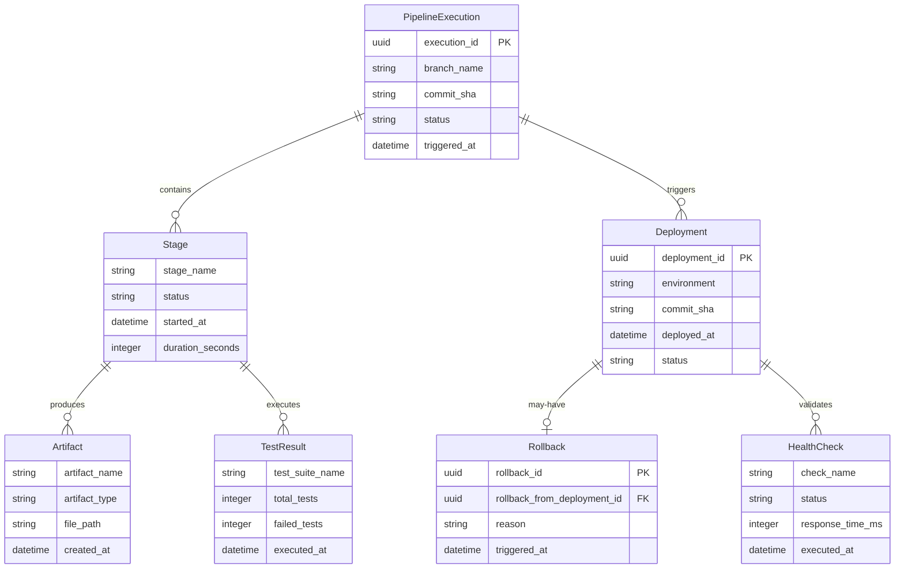

# Data Model: CI/CD Pipeline State & Entities

**Date**: 2026-02-13  
**Feature**: CI/CD Pipeline with Jenkins & Ansistrano

## Overview

This document defines the data entities and state models for the CI/CD pipeline. These entities represent the runtime state of builds, deployments, tests, and rollbacks tracked throughout the pipeline lifecycle.

---

## 1. Pipeline Execution Entity

Represents a single execution instance of the CI/CD pipeline.

### Attributes

| Attribute | Type | Description | Validation |
|-----------|------|-------------|------------|
| `execution_id` | UUID | Unique identifier for pipeline run | Required, UUID v4 |
| `branch_name` | String | Git branch that triggered the pipeline | Required, max 255 chars |
| `commit_sha` | String | Git commit SHA being built/deployed | Required, 40 chars (SHA-1) |
| `commit_message` | String | Git commit message | Optional, max 500 chars |
| `triggered_by` | String | User or system that triggered pipeline | Required, enum: `webhook`, `manual`, `scheduled` |
| `triggered_at` | DateTime | Timestamp when pipeline started | Required, ISO 8601 |
| `status` | String | Current pipeline status | Required, enum: `pending`, `running`, `success`, `failed`, `aborted` |
| `duration_seconds` | Integer | Total pipeline execution time | Optional, calculated on completion |
| `stages` | Array<Stage> | Collection of pipeline stages | Required, min 1 stage |

### State Transitions

```
pending → running → [success | failed | aborted]
                ↓
            (can transition to any stage)
```

### Example (JSON)

```json
{
  "execution_id": "a1b2c3d4-e5f6-7890-abcd-1234567890ab",
  "branch_name": "master",
  "commit_sha": "7f8a9b0c1d2e3f4a5b6c7d8e9f0a1b2c3d4e5f6",
  "commit_message": "feat: add payment gateway integration",
  "triggered_by": "webhook",
  "triggered_at": "2026-02-13T14:30:00Z",
  "status": "running",
  "duration_seconds": null,
  "stages": [...]
}
```

---

## 2. Stage Entity

Represents a single stage within a pipeline execution (e.g., Build, Test, Deploy).

### Attributes

| Attribute | Type | Description | Validation |
|-----------|------|-------------|------------|
| `stage_name` | String | Name of the stage | Required, enum: `build`, `test`, `deploy_test`, `e2e_test`, `deploy_prod`, `smoke_test` |
| `status` | String | Stage execution status | Required, enum: `pending`, `running`, `success`, `failed`, `skipped` |
| `started_at` | DateTime | When stage started | Optional, ISO 8601 |
| `completed_at` | DateTime | When stage completed | Optional, ISO 8601 |
| `duration_seconds` | Integer | Stage execution time | Optional, calculated |
| `logs_url` | String | URL to stage logs in Jenkins | Optional, valid URL |
| `artifacts` | Array<Artifact> | Files produced by this stage | Optional |
| `substages` | Array<Substage> | Parallel substages (e.g., unit/integration tests) | Optional |

### State Transitions

```
pending → running → [success | failed]
                ↓
            skipped (if previous stage fails)
```

### Example (JSON)

```json
{
  "stage_name": "test",
  "status": "running",
  "started_at": "2026-02-13T14:32:00Z",
  "completed_at": null,
  "duration_seconds": null,
  "logs_url": "https://jenkins.myshop.com/job/myshop-pipeline/123/console",
  "artifacts": [],
  "substages": [
    {
      "name": "unit_tests",
      "status": "success",
      "test_results": {
        "passed": 145,
        "failed": 0,
        "skipped": 3
      }
    },
    {
      "name": "integration_tests",
      "status": "running",
      "test_results": null
    }
  ]
}
```

---

## 3. Deployment Entity

Represents a deployment operation to a specific environment.

### Attributes

| Attribute | Type | Description | Validation |
|-----------|------|-------------|------------|
| `deployment_id` | UUID | Unique deployment identifier | Required, UUID v4 |
| `environment` | String | Target environment | Required, enum: `test`, `production` |
| `version` | String | Application version/tag being deployed | Required, semver or commit SHA |
| `commit_sha` | String | Git commit being deployed | Required, 40 chars |
| `deployed_by` | String | User who initiated deployment | Required |
| `deployed_at` | DateTime | Deployment timestamp | Required, ISO 8601 |
| `status` | String | Deployment status | Required, enum: `in_progress`, `success`, `failed`, `rolled_back` |
| `strategy` | String | Deployment strategy used | Required, enum: `ansistrano`, `blue_green`, `canary` |
| `release_path` | String | Absolute path to deployed release | Required, valid absolute path |
| `previous_release_path` | String | Path to previous release (for rollback) | Optional |
| `migration_executed` | Boolean | Whether database migrations ran | Required |
| `migration_count` | Integer | Number of migrations applied | Optional |
| `health_check_status` | String | Post-deployment health status | Optional, enum: `passed`, `failed`, `not_run` |
| `rollback_reason` | String | Reason if rolled back | Optional, present only if status is `rolled_back` |

### State Transitions

```
in_progress → [success | failed]
                     ↓
                rolled_back (manual action)
```

### Example (JSON)

```json
{
  "deployment_id": "d5e6f7a8-b9c0-1234-5678-9abcdef01234",
  "environment": "production",
  "version": "v1.2.3",
  "commit_sha": "7f8a9b0c1d2e3f4a5b6c7d8e9f0a1b2c3d4e5f6",
  "deployed_by": "john.doe",
  "deployed_at": "2026-02-13T15:00:00Z",
  "status": "success",
  "strategy": "ansistrano",
  "release_path": "/var/www/myshop/releases/20260213150000",
  "previous_release_path": "/var/www/myshop/releases/20260213120000",
  "migration_executed": true,
  "migration_count": 2,
  "health_check_status": "passed",
  "rollback_reason": null
}
```

---

## 4. Test Result Entity

Represents the results of test execution (unit, integration, E2E).

### Attributes

| Attribute | Type | Description | Validation |
|-----------|------|-------------|------------|
| `test_suite_name` | String | Name of test suite | Required, enum: `unit`, `integration`, `e2e`, `smoke` |
| `environment` | String | Where tests ran | Required, enum: `ci`, `test`, `production` |
| `status` | String | Overall test status | Required, enum: `passed`, `failed`, `error` |
| `executed_at` | DateTime | Test execution timestamp | Required, ISO 8601 |
| `duration_seconds` | Integer | Total test execution time | Required |
| `total_tests` | Integer | Total test count | Required, >= 0 |
| `passed_tests` | Integer | Number of passed tests | Required, >= 0 |
| `failed_tests` | Integer | Number of failed tests | Required, >= 0 |
| `skipped_tests` | Integer | Number of skipped tests | Optional, >= 0 |
| `coverage_percent` | Float | Code coverage percentage | Optional, 0-100 |
| `report_url` | String | URL to test report (HTML) | Optional, valid URL |
| `failures` | Array<TestFailure> | Details of failed tests | Optional |

### Nested: TestFailure

| Attribute | Type | Description |
|-----------|------|-------------|
| `test_name` | String | Fully qualified test name |
| `error_message` | String | Failure message |
| `stack_trace` | String | Stack trace (truncated) |
| `screenshot_url` | String | Screenshot URL (for E2E tests) |

### Example (JSON)

```json
{
  "test_suite_name": "e2e",
  "environment": "test",
  "status": "failed",
  "executed_at": "2026-02-13T14:45:00Z",
  "duration_seconds": 487,
  "total_tests": 42,
  "passed_tests": 40,
  "failed_tests": 2,
  "skipped_tests": 0,
  "coverage_percent": null,
  "report_url": "https://jenkins.myshop.com/job/myshop-pipeline/123/Playwright_Report/",
  "failures": [
    {
      "test_name": "tests/checkout.spec.ts > Checkout Flow > should complete purchase successfully",
      "error_message": "Timeout 30000ms exceeded waiting for element [data-test=\"order-confirmation\"]",
      "stack_trace": "at CheckoutPage.submitOrder (fixtures/pages/CheckoutPage.ts:45:23)...",
      "screenshot_url": "https://jenkins.myshop.com/artifacts/screenshots/checkout-failure.png"
    }
  ]
}
```

---

## 5. Rollback Entity

Represents a rollback operation restoring a previous deployment.

### Attributes

| Attribute | Type | Description | Validation |
|-----------|------|-------------|------------|
| `rollback_id` | UUID | Unique rollback identifier | Required, UUID v4 |
| `environment` | String | Target environment | Required, enum: `test`, `production` |
| `rollback_from_deployment_id` | UUID | Deployment being rolled back | Required, references Deployment |
| `rollback_to_version` | String | Version being restored | Required |
| `rollback_to_release_path` | String | Release path being restored | Required, valid absolute path |
| `triggered_by` | String | User who initiated rollback | Required |
| `triggered_at` | DateTime | Rollback timestamp | Required, ISO 8601 |
| `reason` | String | Reason for rollback | Required, max 500 chars |
| `status` | String | Rollback status | Required, enum: `in_progress`, `success`, `failed` |
| `duration_seconds` | Integer | Rollback execution time | Optional |
| `health_check_status` | String | Post-rollback health check | Optional, enum: `passed`, `failed` |

### Example (JSON)

```json
{
  "rollback_id": "f0a1b2c3-d4e5-6789-0abc-def123456789",
  "environment": "production",
  "rollback_from_deployment_id": "d5e6f7a8-b9c0-1234-5678-9abcdef01234",
  "rollback_to_version": "v1.2.2",
  "rollback_to_release_path": "/var/www/myshop/releases/20260213120000",
  "triggered_by": "jane.smith",
  "triggered_at": "2026-02-13T15:15:00Z",
  "reason": "Critical bug causing 500 errors on checkout page",
  "status": "success",
  "duration_seconds": 45,
  "health_check_status": "passed"
}
```

---

## 6. Artifact Entity

Represents files produced during pipeline stages (builds, reports, logs).

### Attributes

| Attribute | Type | Description | Validation |
|-----------|------|-------------|------------|
| `artifact_name` | String | Human-readable artifact name | Required, max 255 chars |
| `artifact_type` | String | Type of artifact | Required, enum: `build`, `report`, `log`, `screenshot` |
| `file_path` | String | Relative path within Jenkins workspace | Required |
| `file_size_bytes` | Integer | File size in bytes | Optional, >= 0 |
| `created_at` | DateTime | When artifact was created | Required, ISO 8601 |
| `download_url` | String | URL to download artifact | Optional, valid URL |
| `retention_days` | Integer | Days to retain artifact | Optional, default 30 |

### Example (JSON)

```json
{
  "artifact_name": "composer-vendor.tar.gz",
  "artifact_type": "build",
  "file_path": "artifacts/vendor.tar.gz",
  "file_size_bytes": 45231456,
  "created_at": "2026-02-13T14:31:00Z",
  "download_url": "https://jenkins.myshop.com/job/myshop-pipeline/123/artifact/vendor.tar.gz",
  "retention_days": 30
}
```

---

## 7. Health Check Entity

Represents post-deployment health verification.

### Attributes

| Attribute | Type | Description | Validation |
|-----------|------|-------------|------------|
| `check_name` | String | Name of health check | Required |
| `environment` | String | Environment checked | Required, enum: `test`, `production` |
| `executed_at` | DateTime | Check execution time | Required, ISO 8601 |
| `status` | String | Check result | Required, enum: `passed`, `failed`, `warning` |
| `response_time_ms` | Integer | Response time in milliseconds | Optional, >= 0 |
| `details` | Object | Check-specific details | Optional |
| `error_message` | String | Error if check failed | Optional |

### Check Types

- **HTTP Health**: `GET /health` returns 200 OK
- **Database Check**: `GET /api/health/database` validates MySQL/MongoDB connectivity
- **Redis Check**: `GET /api/health/redis` validates cache connectivity
- **RabbitMQ Check**: `GET /api/health/rabbitmq` validates message queue connectivity

### Example (JSON)

```json
{
  "check_name": "http_health",
  "environment": "production",
  "executed_at": "2026-02-13T15:01:00Z",
  "status": "passed",
  "response_time_ms": 45,
  "details": {
    "http_code": 200,
    "environment": "prod",
    "version": "v1.2.3"
  },
  "error_message": null
}
```

---

## Entity Relationships



---

## Storage & Persistence

### Jenkins Build Metadata
- **Storage**: Jenkins stores pipeline execution data in its workspace and database
- **Retention**: Build data retained for 50 builds (configurable)
- **Access**: Jenkins REST API provides programmatic access to build metadata

### Deployment State (Ansible)
- **Storage**: Deployment metadata stored on target servers in `/var/www/myshop/.deployment_history.json`
- **Format**: JSON file appended with each deployment
- **Backup**: Included in server backup routine

### Test Results
- **Storage**: JUnit XML format stored in Jenkins workspace (`var/log/phpunit/*.xml`)
- **Playwright**: HTML reports stored in `tests/E2E/playwright-report/`
- **Retention**: 30 days (Jenkins artifact cleanup policy)

### Example Deployment History File
```json
{
  "deployments": [
    {
      "deployment_id": "d5e6f7a8-b9c0-1234-5678-9abcdef01234",
      "environment": "production",
      "version": "v1.2.3",
      "deployed_at": "2026-02-13T15:00:00Z",
      "deployed_by": "john.doe",
      "status": "success"
    },
    {
      "deployment_id": "a1b2c3d4-e5f6-7890-abcd-1234567890ab",
      "environment": "production",
      "version": "v1.2.2",
      "deployed_at": "2026-02-13T12:00:00Z",
      "deployed_by": "jane.smith",
      "status": "success"
    }
  ]
}
```

---

## Validation Rules

### Global Rules
- All timestamps must be in UTC (ISO 8601 format)
- All UUIDs must be version 4
- All enums must use lowercase with underscores
- All file paths must be absolute or workspace-relative

### Business Rules
- **Deployment**: Cannot deploy to production if test deployment failed
- **Rollback**: Can only rollback to a previously successful deployment
- **Test**: Must have at least 1 test executed (total_tests > 0)
- **Health Check**: All checks must pass for deployment to be considered successful

---

## API Integration Points

These entities are exchanged between:
1. **Jenkins → Slack**: Pipeline execution status notifications
2. **Jenkins → Ansible**: Deployment parameters and commit SHA
3. **Ansible → Jenkins**: Deployment completion status
4. **Playwright → Jenkins**: Test results and artifacts
5. **Health Checks → Jenkins**: Post-deployment verification results

See [contracts/](contracts/) directory for detailed API schemas.

---

## Next Steps

- Define API contracts for Jenkins/Ansible integration
- Create JSON schemas for entity validation
- Implement health check endpoints in Symfony
- Design deployment history storage mechanism
